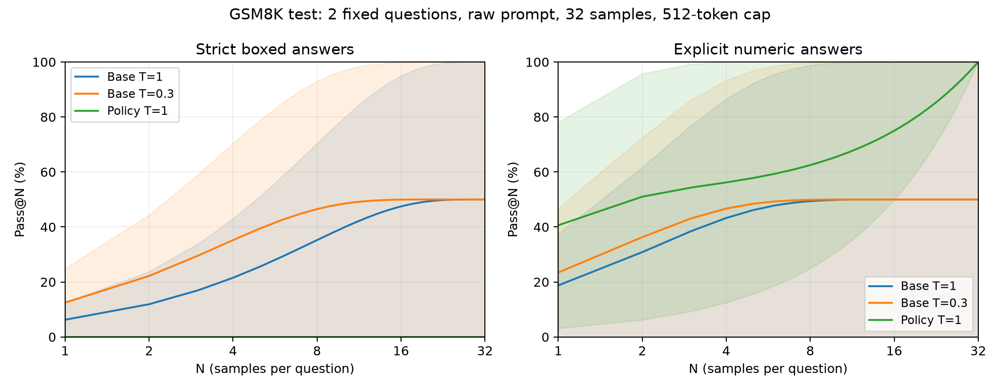

# Raw-prompt pass@N comparison

All three conditions use the same 2 GSM8K test questions, selected without replacement using Python random seed 0; sorted original indices are saved in config.json. Each question has 32 samples per condition (192 responses total).

The prompt is exactly the raw question used during policy training, with no chat template, few-shot demonstrations or R1 tags. Generation ends at EOS or 512 tokens. All conditions use vLLM, BF16, top-p=1, top-k disabled, no penalties or stop strings. Per-question seeds are 42000 + original test index, paired across conditions. The final 158-update policy adapter is loaded directly through vLLM LoRA (adapter weights cast to BF16 for inference); no merging or further training. This is a new matched-vLLM evaluation, so differences from earlier HF results also reflect the subset, decoder and random draws.

For c successes among m samples, pass@N = 1 − C(m−c,N)/C(m,N), averaged over questions. It measures whether an oracle could find a correct candidate, not majority-vote accuracy. At N=m it is the fraction of questions with at least one observed success. The numeric extraction rule was fixed in the previous experiment and is applied unchanged; strict boxed scoring remains separate. Numeric correctness does not validate the reasoning.

## Strict boxed

| Condition | Pass@1 | Pass@2 | Pass@4 | Pass@8 | Pass@16 | Pass@32 |
|---|---:|---:|---:|---:|---:|---:|
| Base T=1 | 6.25% | 11.90% | 21.53% | 35.23% | 47.47% | 50.00% |
| Base T=0.3 | 12.50% | 22.18% | 35.23% | 46.50% | 49.94% | 50.00% |
| Policy T=1 | 0.00% | 0.00% | 0.00% | 0.00% | 0.00% | 0.00% |

Policy minus baseline, percentage points with paired question-bootstrap 95% intervals:

- vs Base T=1, N=1: -6.25 [-12.50, +0.00].
- vs Base T=1, N=32: -50.00 [-100.00, +0.00].
- vs Base T=0.3, N=1: -12.50 [-25.00, +0.00].
- vs Base T=0.3, N=32: -50.00 [-100.00, +0.00].
## Explicit numeric

| Condition | Pass@1 | Pass@2 | Pass@4 | Pass@8 | Pass@16 | Pass@32 |
|---|---:|---:|---:|---:|---:|---:|
| Base T=1 | 18.75% | 30.85% | 43.26% | 49.40% | 50.00% | 50.00% |
| Base T=0.3 | 23.44% | 36.29% | 46.69% | 49.88% | 50.00% | 50.00% |
| Policy T=1 | 40.62% | 51.01% | 56.20% | 62.50% | 75.00% | 100.00% |

Policy minus baseline, percentage points with paired question-bootstrap 95% intervals:

- vs Base T=1, N=1: +21.88 [+3.12, +40.62].
- vs Base T=1, N=32: +50.00 [+0.00, +100.00].
- vs Base T=0.3, N=1: +17.19 [+3.12, +31.25].
- vs Base T=0.3, N=32: +50.00 [+0.00, +100.00].

## Behavior and cost

| Condition | Boxed parse | Numeric parse | Mean tokens | Truncated | Unique texts/question | Generation + scoring minutes |
|---|---:|---:|---:|---:|---:|---:|
| Base T=1 | 35.94% | 82.81% | 278.3 | 20.31% | 32.00 | 0.06 |
| Base T=0.3 | 70.31% | 93.75% | 275.3 | 6.25% | 30.50 | 0.06 |
| Policy T=1 | 0.00% | 100.00% | 109.3 | 0.00% | 31.50 | 0.11 |

## Limits

One trained checkpoint and one decoding seed protocol; no seed uncertainty is included. Intervals are pointwise, not simultaneous bands or multiplicity-adjusted claims. Previously viewed test results informed the decision to run this evaluation, so this is exploratory, not a pristine held-out confirmation. Finite sample pass@N does not measure the full answer support. No checkpoint or subset was selected by these outcomes.

Full N=1…32 arrays, intervals, indices and settings: [summary.json](../results/pass_at_n/raw_smoke_bf16_n32/summary.json). All raw responses, generated token IDs and per-sample grades are retained in the adjacent JSONL files.
