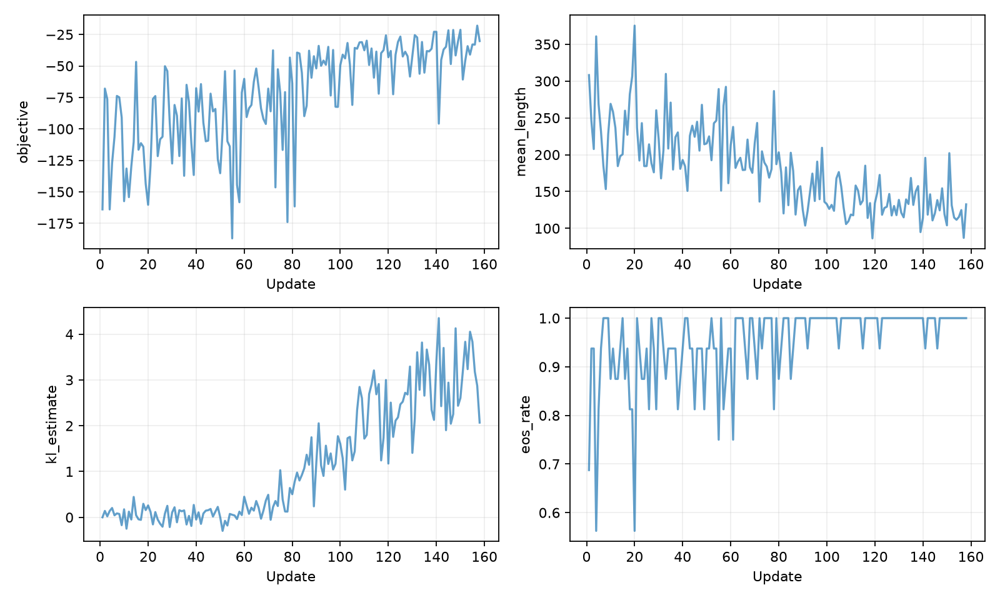
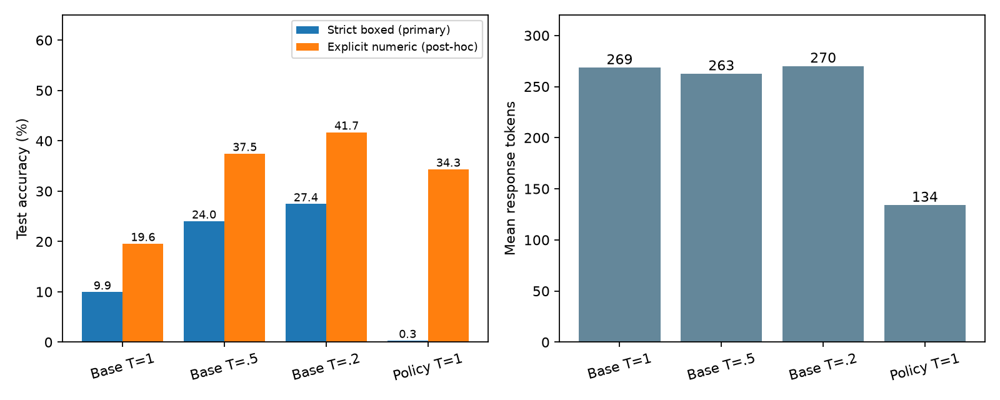

# Fixed-alpha power policy on GSM8K

## Protocol

Qwen2.5-0.5B; frozen base; all-linear LoRA rank 8, LoRA scaling alpha 16; power alpha 2. HF Transformers/PEFT, BF16/SDPA, raw questions, 512-token cap, strict boxed-answer grading. Each fresh batch contains four questions and four responses per question. Sequence log-probabilities include EOS; the update uses a leave-one-out baseline, without correctness rewards or length/advantage normalization.

Training completed **158 updates in 27.58 minutes** (termination: `time_budget`). The final completed checkpoint was used; no checkpoint was selected by evaluation accuracy. Development and test evaluation ran separately.

Training used seed 0 and processed 632 question presentations from the 1,024 selected training questions. Evaluation used seed 2026 (deterministic per-batch offsets), generation batch size 64, and all 1,319 test questions. The four test conditions differ only in temperature or adapter.

The run sampled 454,672 training tokens; peak allocated GPU memory was 6.38 GB. Gradient clipping triggered on 100.0% of updates.

## Evaluation

| Condition | Questions | Samples/question | Accuracy | Pass@k | Parse rate | Mean tokens | EOS rate |
|---|---:|---:|---:|---:|---:|---:|---:|
| dev_initial | 256 | 1 | 14.45% | 14.45% | 39.06% | 257.1 | 87.50% |
| dev_policy | 256 | 1 | 0.00% | 0.00% | 0.78% | 126.4 | 100.00% |
| diagnostic_final | 64 | 4 | 1.56% | 4.69% | 1.56% | 130.0 | 100.00% |
| diagnostic_step_0000 | 64 | 4 | 17.97% | 50.00% | 43.75% | 251.0 | 91.02% |
| diagnostic_step_0032 | 64 | 4 | 16.02% | 40.62% | 41.41% | 238.4 | 92.58% |
| diagnostic_step_0064 | 64 | 4 | 10.94% | 34.38% | 25.78% | 210.2 | 93.36% |
| diagnostic_step_0128 | 64 | 4 | 1.17% | 4.69% | 2.73% | 137.0 | 99.22% |
| test_base | 1319 | 1 | 9.93% | 9.93% | 39.12% | 268.6 | 85.60% |
| test_policy | 1319 | 1 | 0.30% | 0.30% | 1.97% | 134.1 | 99.24% |
| test_t02 | 1319 | 1 | 27.45% | 27.45% | 65.81% | 270.1 | 93.93% |
| test_t05 | 1319 | 1 | 24.03% | 24.03% | 58.15% | 262.7 | 92.57% |

## Paired test comparisons

- Policy minus test_base: -9.63 percentage points (question-bootstrap 95% CI [-11.30, -8.04]).
- Policy minus test_t05: -23.73 percentage points (question-bootstrap 95% CI [-26.08, -21.46]).
- Policy minus test_t02: -27.14 percentage points (question-bootstrap 95% CI [-29.57, -24.72]).

## Post-hoc format sensitivity

The original boxed-answer metric remains primary. After inspecting development outputs, we additionally scored explicit `####` and `answer is/:/=` markers for every condition. See [the frozen extraction rules](GRADING_SENSITIVITY.md). This measures final-answer agreement, not validity of the derivation.

| Condition | Numeric answer accuracy | Parse rate | Numeric pass@k |
|---|---:|---:|---:|
| dev_initial | 30.47% | 74.61% | 30.47% |
| dev_policy | 45.70% | 99.61% | 45.70% |
| diagnostic_final | 46.09% | 99.61% | 70.31% |
| diagnostic_step_0000 | 31.64% | 76.95% | 70.31% |
| diagnostic_step_0032 | 31.25% | 81.64% | 65.62% |
| diagnostic_step_0064 | 35.94% | 82.03% | 65.62% |
| diagnostic_step_0128 | 43.36% | 95.70% | 70.31% |
| test_base | 19.56% | 71.34% | 19.56% |
| test_policy | 34.34% | 97.12% | 34.34% |
| test_t02 | 41.70% | 89.76% | 41.70% |
| test_t05 | 37.45% | 85.22% | 37.45% |

- Numeric policy minus test_base: +14.78 percentage points (question-bootstrap 95% CI [+12.05, +17.59]).
- Numeric policy minus test_t05: -3.11 percentage points (question-bootstrap 95% CI [-5.91, -0.30]).
- Numeric policy minus test_t02: -7.35 percentage points (question-bootstrap 95% CI [-10.16, -4.47]).

## Held-out objective and behavior

- diagnostic_final: J=-31.441, estimated KL=3.673, sequence entropy=24.095, first-token EOS=0.00%, short (<16-token) responses=0.00%, mean unique responses=4.00, mean unique explicit answers=2.56.
- diagnostic_step_0000: J=-116.215, estimated KL=0.000, sequence entropy=116.215, first-token EOS=0.39%, short (<16-token) responses=0.39%, mean unique responses=4.00, mean unique explicit answers=2.47.
- diagnostic_step_0032: J=-99.076, estimated KL=0.021, sequence entropy=99.033, first-token EOS=0.39%, short (<16-token) responses=0.39%, mean unique responses=4.00, mean unique explicit answers=2.59.
- diagnostic_step_0064: J=-85.360, estimated KL=0.291, sequence entropy=84.777, first-token EOS=0.39%, short (<16-token) responses=0.39%, mean unique responses=4.00, mean unique explicit answers=2.39.
- diagnostic_step_0128: J=-36.224, estimated KL=2.577, sequence entropy=31.069, first-token EOS=0.00%, short (<16-token) responses=0.00%, mean unique responses=3.98, mean unique explicit answers=2.59.

## Observed inference cost

Single-run batched generation timings on GPU 1, batch size 64, excluding model loading. These include decoding and writing outputs and are not a controlled latency benchmark.

| Condition | Total seconds | Amortized ms/question |
|---|---:|---:|
| test_base | 101.8 | 77.2 |
| test_t05 | 118.6 | 90.0 |
| test_t02 | 116.6 | 88.4 |
| test_policy | 116.7 | 88.4 |

## Limits

This is a single training seed and a single decoding seed. Question-bootstrap intervals do not include seed uncertainty. The wall-clock budget takes precedence over the planned 256 updates. Training-batch objective values mix different questions; use held-out diagnostics for before/after comparisons. An improving objective alone does not prove closeness to the exact power distribution or improved reasoning. Historical vLLM/MCMC results are not used as matched-backend baselines.

## Validation

The CPU suite passed all 18 tests, including an enumerated RLOO gradient check, EOS/padding masks, microbatch gradient equivalence, frozen-reference invariance, adapter/optimizer/RNG restoration and explicit-answer extraction. A real-model alpha=1 identity smoke run produced zero gradient and byte-identical adapter weights. Five short alpha=2 smoke updates and a two-update 512-token probe completed before the formal run. Training/development question separation and the unchanged formal training source hashes were verified.

Raw responses, token IDs, configs, training scores and checkpoints are saved alongside this report.

<!-- MCMC_COMPARISON -->
## MCMC power sampling comparison (supplement)

Archived vLLM results cover all 1,319 GSM8K test questions with three decoding seeds. The original responses were regraded using the policy experiment's strict boxed and explicit numeric answer rules. No responses were resampled or seeds selected by their outcomes.

| Condition | Backend / seeds | Strict accuracy | Numeric accuracy | Output tokens/question | Generated tokens/question |
|---|---|---:|---:|---:|---:|
| Base T=1 | HF / 1 | 9.93% | 19.56% | 268.6 | 268.6 |
| Base T=0.5 | HF / 1 | 24.03% | 37.45% | 262.7 | 262.7 |
| Base T=0.2 | HF / 1 | 27.45% | 41.70% | 270.1 | 270.1 |
| Power policy α=2, T=1 | HF / 1 | 0.30% | 34.34% | 134.1 | 134.1 |
| Archived base T=1 | vLLM / mean of 3 | 12.03% | 21.13% | 272.1 | 272.1 |
| Archived base T=0.2 | vLLM / mean of 3 | 29.09% | 41.95% | 274.9 | 274.9 |
| MCMC power alpha=4 | vLLM / mean of 3 | 32.95% | 46.50% | 250.9 | 1635.9 |

MCMC uses the frozen base, power α=4, proposal T=0.25, block size 32, two Metropolis–Hastings updates per block, a 512-token cap, and the `full` suffix probability ratio. Each block first extends the sequence from the proposal, then selects a random suffix boundary and resamples that suffix. Acceptance uses the base and proposal sequence probabilities: `min(1, exp(α·Δlog p0 − Δlog q))`. This finite-step autoregressive MCMC implementation does not produce independent samples from the exact power distribution.

MCMC requires multiple proposal and reference-scoring passes per question at inference time, without training. The policy first trains an adapter and then uses ordinary sampling. MCMC generated-token counts include extensions and rejected proposals, but exclude reference-scoring forward passes. Policy costs do not amortize the earlier 27m 35s training run.

**This is a historical algorithm reference; its differences from the policy do not isolate method quality.** Power α differs (4 versus 2), as do the backend (vLLM versus HF), random seeds, and number of seeds. MCMC settings were previously selected on development data. Archived vLLM base and low-temperature results are included to expose differences between backends and experiment batches. The archived MCMC files do not record an explicit `seed_policy` field; original configs and file hashes are retained in the supplement.

[Machine-readable summary and individual seeds](../results/mcmc_comparison.json) · [Original MCMC report](../../gsm8k_qwen05b/reports/REPORT.md) · [Sampler implementation](../../../src/power_sampling/sampler.py)
