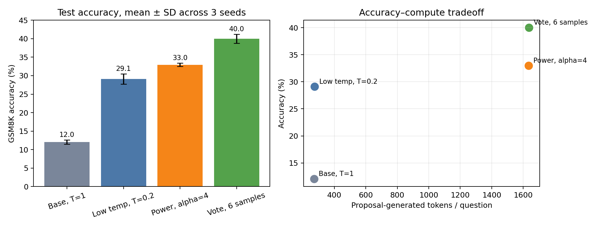

# E001 · GSM8K · Qwen2.5-0.5B

Reproduction of Karan and Du's [*Reasoning with Sampling*](https://arxiv.org/abs/2510.14901),
cross-checked against the [official implementation](https://github.com/aakaran/reasoning-with-sampling).
Uses raw GSM8K questions with no prompt suffix and batched vLLM inference.

## Results

Across three independently seeded full-test runs, accuracy was **12.03%** for
base sampling, **29.09%** for the selected low-temperature proposal, and
**32.95%** for power sampling. The paired, question-clustered gain over low
temperature was +3.87 percentage points (95% bootstrap CI [2.40, 5.31]).

Six-sample self-consistency reached **39.98%** at a similar proposal-generated-token
budget. Exploratory ten-sample voting reached 44.66% in one seed. Increasing
power sampling to ten MCMC updates per block gave 32.52% at 6,119 proposal tokens
per question.



[Full report](reports/REPORT.md) · [PDF](reports/report.pdf) ·
[Notebook](notebooks/results.ipynb) · [Paired examples](reports/QUALITATIVE_EXAMPLES.md)

## Run

Install once using the [repository setup](../../SETUP.md#setup). The following
commands run from this experiment directory with that environment activated:

```bash
CUDA_VISIBLE_DEVICES=1 python run.py \
  --name test_power --method power --split test --limit 1319 \
  --alpha 4 --proposal-temperature 0.25 --mcmc-steps 2 \
  --block-size 32 --max-tokens 512 --seed 0

CUDA_VISIBLE_DEVICES=1 python run_vote.py \
  --name test_vote --samples 6 --temperature 0.2 --seed 0

python analyze.py
python scripts/build_notebook.py
python scripts/build_report.py
```

`run.py` also supports `--method base` and `--method low_temp`. Results go to
`results/`; analysis reads the saved named runs and writes `results/summary.json`,
`figures/`, and `reports/QUALITATIVE_EXAMPLES.md`. The notebook and PDF builders
use these saved summaries and figures. New runs need to be included explicitly
in `analyze.py` to enter the formal comparison.

`--seed-policy per_example` is the default. The diagnostic `batch` policy assigns
the same seed to every vLLM request, causing correlated random streams; it is not
suitable for a formal comparison.

## Files

- `data/gsm8k/`: local train and test JSONL files.
- `results/`: formal runs, ablations, diagnostics, and generated responses.
- `notes/`: original plan, research notes, and chronological activity log;
  historical commands use the directory layout at the time they were recorded.
- [`../../src/power_sampling/`](../../src/power_sampling/): sampler and grader.
- [`../../tests/test_gsm8k.py`](../../tests/test_gsm8k.py): CPU tests.

From the repository root, `python scripts/verify_portability.py` checks both
experiments. The notebook runs from the repository root, this directory, or
`notebooks/`.
