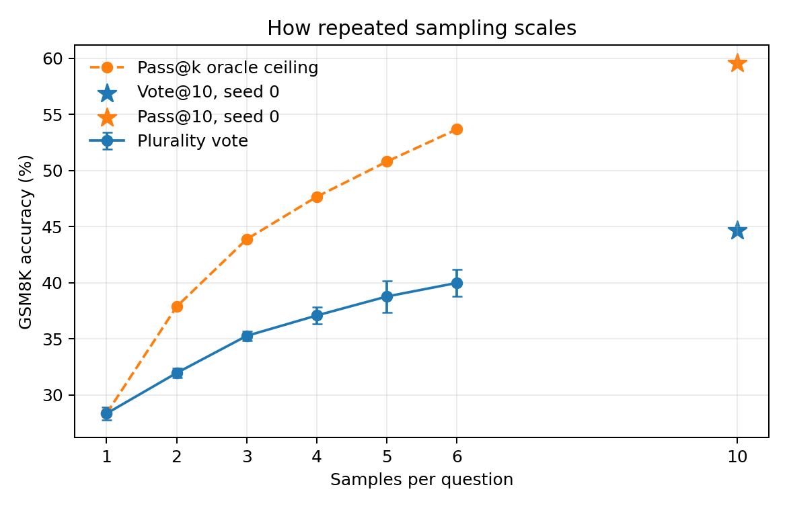
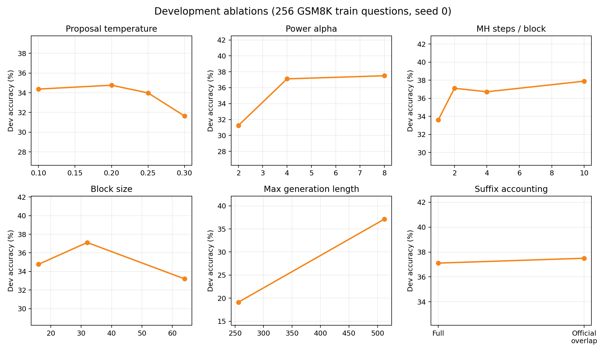
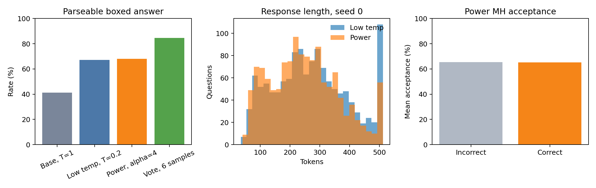

# Small-Scale Reproduction of Reasoning with Sampling

**Model:** Qwen2.5-0.5B  
**Task:** GSM8K, raw question-only prompting  
**Inference:** vLLM on physical GPU 1  
**Date:** 30 August 2026

## Executive summary

This study reproduces the core autoregressive MCMC algorithm from Karan and Du's *Reasoning with Sampling* using a model more than an order of magnitude smaller than those emphasized in the paper. The experiment asks whether sampling from a sequence-level powered distribution, proportional to `p(x)^alpha`, can improve reasoning without training or a verifier.

It can, but it was not the most efficient inference-time method in this setting. Across three full GSM8K test runs, temperature-1 sampling reached **12.03%**, the selected low-temperature control reached **29.09%**, and power sampling reached **32.95%**. The paired gain of power over low temperature was **3.87 percentage points** with a question-clustered 95% bootstrap interval of **[2.40, 5.31]**. At nearly the same proposal-generated-token budget, six-sample self-consistency reached **39.98%**.

The conclusion is narrow but useful: sequence-level reweighting improved this frozen 0.5B model and reduced seed variance, yet simple repeated sampling and voting used the budget better.

A final single-seed exploration increased voting to ten samples and reached **44.66%**, the best observed result. The paper-default ten MCMC updates per block reached only **32.52%** while using more than twice as many proposal tokens as vote@10.

## Method

For a base model `p`, the target response distribution is

\[
\pi(x) \propto p(x)^\alpha.
\]

Generation proceeds block by block. After each low-temperature extension, an MCMC update chooses a random cut inside the generated response and samples a replacement suffix from proposal distribution `q`. The candidate is accepted using the full Metropolis–Hastings correction:

\[
\log r = \alpha[\log p(x')-\log p(x)] + \log q(x)-\log q(x').
\]

The final configuration uses alpha 4, proposal temperature 0.25, a 32-token block, two updates per block, and at most 512 response tokens. This gives 16 blocks, matching the paper's block count while making the experiment practical on one RTX 4090. All suffix proposals and likelihood evaluations are batched through vLLM.

GSM8K's first 256 train questions form the development set. The complete 1,319-question test split is evaluated across three seeds. Each example receives a deterministic independent random stream. The prompt is exactly the question text: the model is never told to reason step by step or to use `\boxed{}`. Accuracy nevertheless uses the existing strict question-only protocol: a response is correct only if its last boxed value matches the GSM8K answer.

## Results

| Method | Seed accuracies | Mean ± SD | Parse rate | Proposal tokens/question |
|---|---|---:|---:|---:|
| Temperature 1 | 11.37, 12.36, 12.36% | **12.03 ± 0.57%** | 41.14% | 272 |
| Temperature 0.2 | 30.63, 28.73, 27.90% | **29.09 ± 1.40%** | 67.05% | 275 |
| Power, alpha 4 | 32.60, 32.83, 33.43% | **32.95 ± 0.43%** | 67.93% | 1,636 |
| Six-sample vote | 38.74, 41.17, 40.03% | **39.98 ± 1.21%** | 84.66% | 1,638 |

Power sampling's 3.87-point gain over low-temperature sampling is unlikely to be a consequence of question composition: resampling questions while preserving all seed outcomes gives a 95% interval of [2.40, 5.31]. However, power needs roughly six times as many generated proposal tokens and additional scoring passes. Six ordinary low-temperature samples followed by numeric majority voting outperform power by 7.03 points, interval [5.48, 8.59].

The vote control's higher parse rate explains part of its advantage: six attempts substantially increase the probability that at least one coherent boxed answer is available. Paired examples, including cases that flip in both directions, are retained in `QUALITATIVE_EXAMPLES.md` rather than selected only for success.

Plurality voting improves monotonically from 28.33% at one sample to 39.98% at six. The pass@6 ceiling is 53.68%, showing that answer aggregation—not response diversity alone—leaves substantial room for improvement. The seed-0 ten-sample points are shown separately because they do not have three-seed uncertainty estimates.

## Ablations

Three patterns stand out. First, alpha 4–8 is substantially better than alpha 2, but alpha 8 does not improve the single full-test comparison. Second, two MCMC updates are enough in this budget: four cost more and do not improve development accuracy. Third, 512 output tokens are indispensable for this base model. At 256 tokens, most responses do not reach a parseable final answer, and both ordinary and power accuracy nearly halve.

Ten MCMC updates slightly raise development accuracy from 37.11% to 37.89%, but the corresponding full-test seed falls from 32.60% to 32.52% while proposal tokens increase from 1,645 to 6,119. The extra transitions are therefore not justified here.

The released reference code and the paper disagree in one EOS edge case. The paper's acceptance ratio compares complete suffixes, while the code truncates the current suffix to the length of an early-terminating candidate. The reproduction keeps the mathematically correct full suffix as its default and exposes the reference behavior as `official_overlap`. The difference was only 0.39 points on the development slice.

Power and low-temperature sampling have nearly identical boxed-answer parse rates, while voting gains substantially from repeated opportunities. Correct and incorrect power responses also have almost identical MH acceptance rates (65.18% and 65.38%), so acceptance rate should be treated as a sampler diagnostic rather than a quality score.

## Reliability checks

Unit tests cover answer parsing, identity-kernel algebra, and unequal suffix lengths. A GPU identity test revealed that BF16 log probabilities obtained during vLLM generation and during prompt scoring can differ slightly and accumulate over a sequence. The alpha=1, temperature=1 identity case is enforced analytically; the main settings retain the measured proposal correction, which leaves a small numerical limitation.

Seed handling also matters. Reusing one identical seed for every request creates correlated random streams and gave benchmark accuracies ranging from 9.86% to 19.86%. Formal results instead derive independent streams per example. This explains why the parent project's earlier one-seed question-only baseline was about 20% while the stable three-seed estimate here is about 12%; the standalone grader itself was verified to make identical judgments on the earlier saved responses.

## Limitations and conclusion

This is an algorithmic reproduction, not a direct numerical replication. It uses a 0.5B general model rather than a 7B math model, two rather than ten MCMC updates per block, strict boxed-answer evaluation, and one benchmark. The nominal cost comparison counts proposal-generated tokens but omits power sampling's likelihood-scoring work. GPU wall time was affected by another process and is not used as the principal efficiency measure.

Within those boundaries, the evidence is consistent across seeds: power sampling moves Qwen2.5-0.5B toward better GSM8K responses without changing model weights. It also shows why a strong baseline matters. On this model, ordinary low temperature captures most of the single-sample gain, and self-consistency is decisively better at a matched proposal-token budget.

## Sources

- Aayush Karan and Yilun Du, [*Reasoning with Sampling: Your Base Model is Smarter Than You Think*](https://arxiv.org/abs/2510.14901), 2025.
- Karan and Du, [official PyTorch implementation](https://github.com/aakaran/reasoning-with-sampling).
